# How to set up an EC2 instance

Here are the steps to set up an EC2 instance on AWS.

##### Basic startup steps

First head over to the AWS and login.
Find and then select the option to Launch a Virtual Machine. 
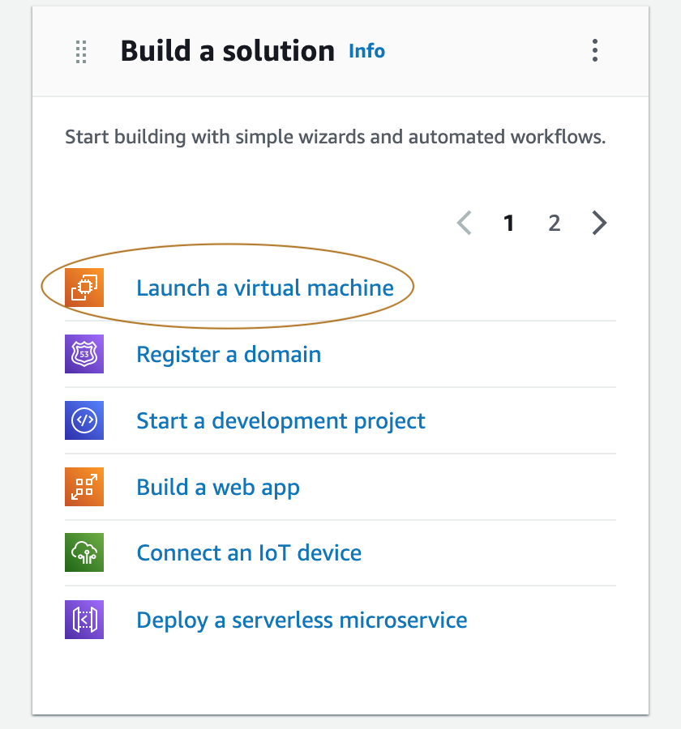

##### Select the feature for your EC2 instance

First you input a name for your EC2 instance, make sure to use a good naming 
convention

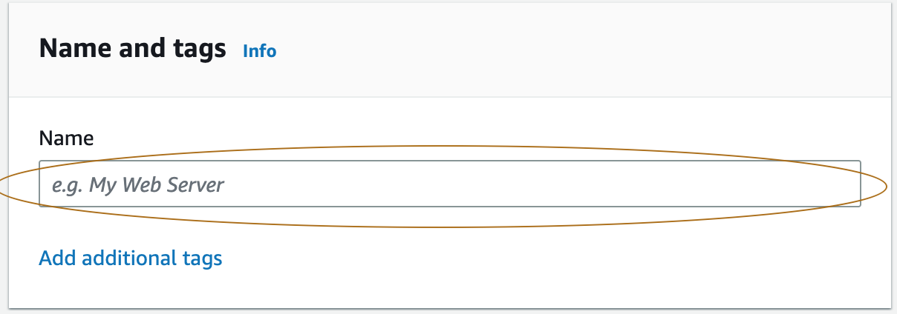

Then you select an AMI - chose ubuntu
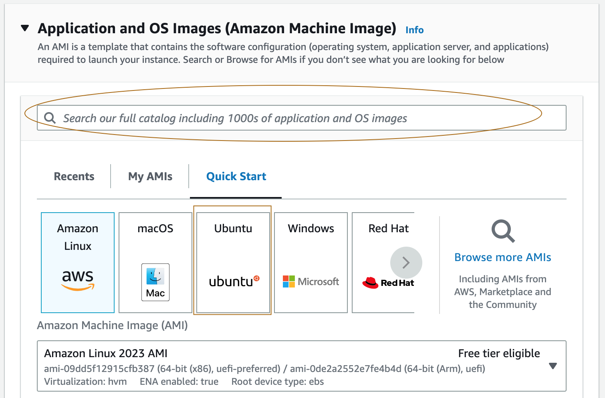

Leave the instance type as t2.micro

Select a keypair - if you don't have one then create one.

Under 'Network Settings' makesure SSH traffic is from your "My IP" address and select the checkbox 
to allow HTTP traffic from the internet.

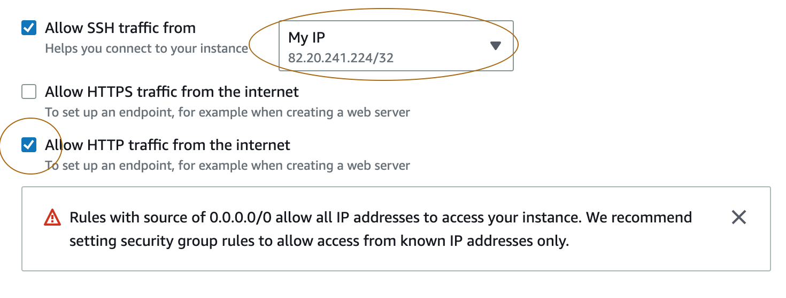

Whilst in the 'Network Settings' section, click edit and ensure you name your security with similar naming convention 
as earlier.

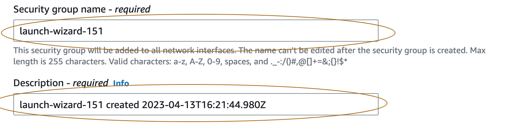

keep the other features as is for now and the click 'Launch Instance'.

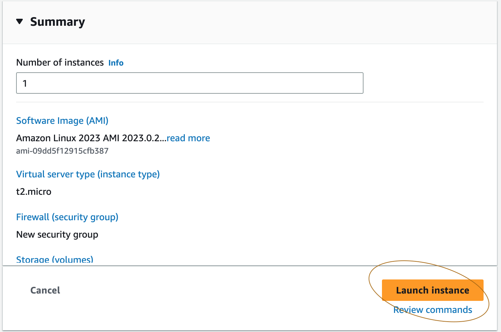

##### Launch Instance

Once your ec2 instance has been initialized then navigate to your running instance, select the checkbox 
and press connect. 

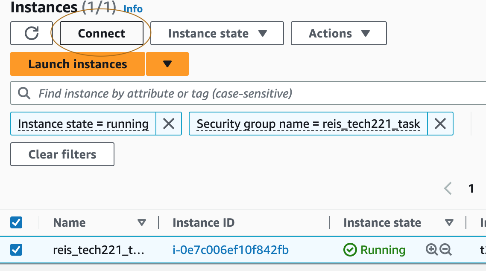

Make sure you're in the "SSH Client" tab and then head over to Git Bash App.

When in Git Bash, go to the folder where your .pem file is saved, then follow the instructions from aws.

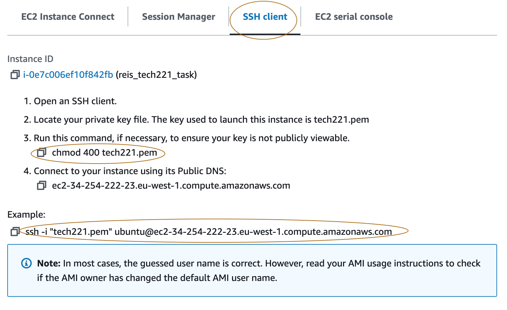

Once you are connected to aws from your Git bash the command line will start with something like


# How to amend a security group in AWS

Once you have launched your EC2 instance with a security group you can, if like, amend the security group.

- To do this, check the box for the instance. In the panel underneath, navigate to the security tab.
Once on the security tab, click on the link to the security group.

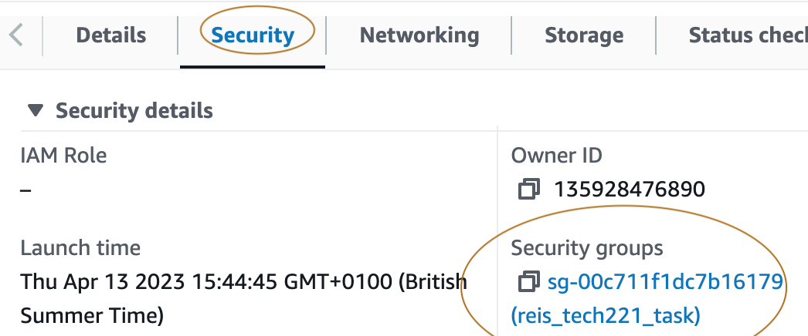


- Then click on "Edit Inbound Rules"

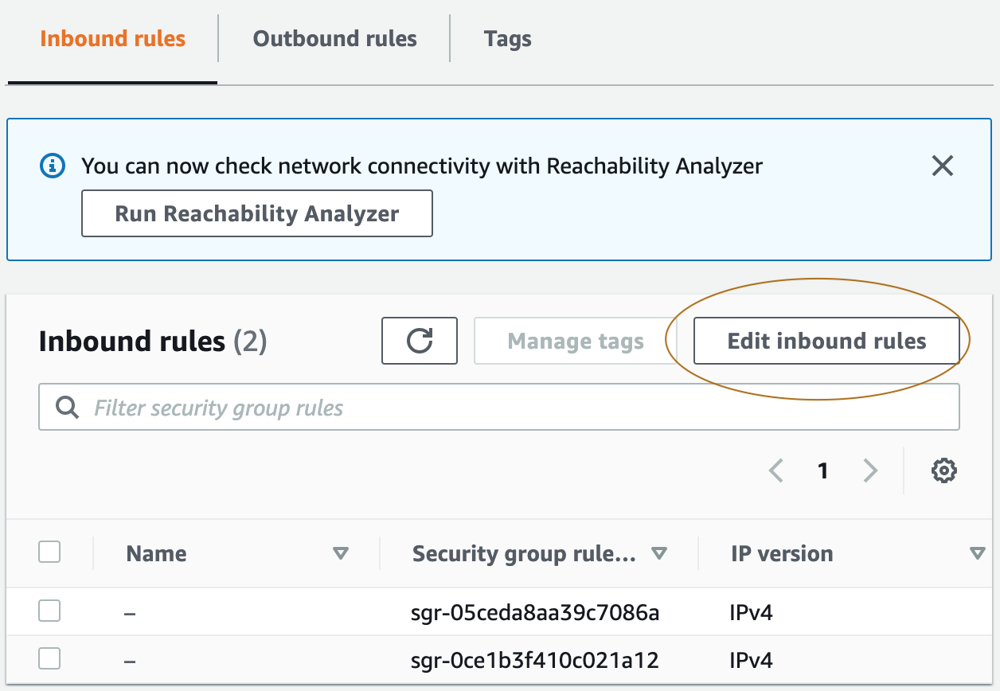

At this point you can add new inbound rules and/or delete rules. Once the necessary changes have been made, 
click on "Save Rules"

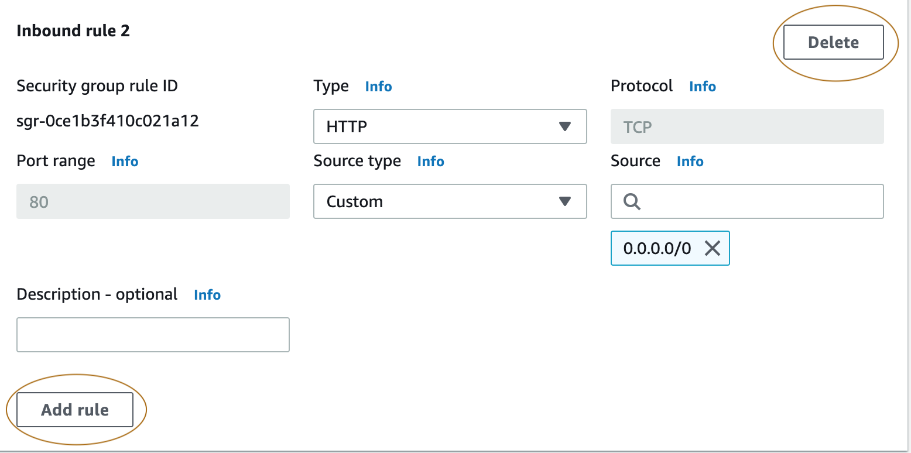


###  Automate the process: 
- bash scripting - when a scripting file is created it should end with `.sh`

- we can create this file using `touch "file_name.sh"`

- we can then write to it - `sudo nano script.sh` and add the following text.
, to save and exit press CTRL+X and then Y for yes.
```
#!/bin/bash
# update
sudo apt update -y
# upgrade
sudo apt upgrade -y
# install Nginx
sudo apt install nginx -y
# restart Nginx
sudo systemctl restart nginx
# enable Nginx
sudo systemctl enable nginx
```

- we then need to make the file executable with `sudo chmod +x "file_name"`

- Then we can run the script: `sudo ./"file_name"` and our script should automate the 
commands.
